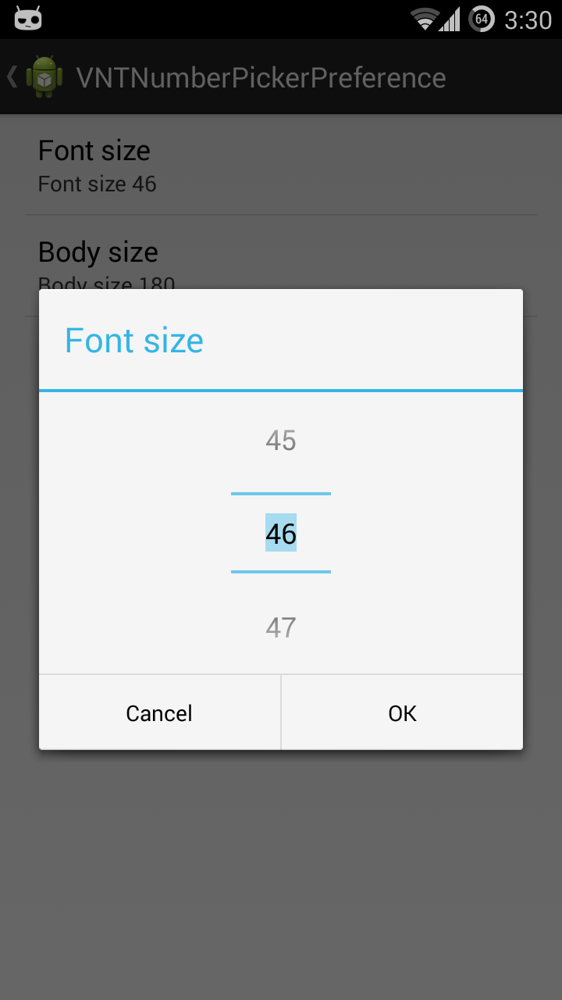

VNTNumberPickerPreference
=========================

This is an easy to use custom preference, which opens a dialog with a number picker. The value gets automatically saved and you can set the default-, min- and maxValue conveniently in the XML.

```xml
<com.vanniktech.vntnumberpickerpreference.VNTNumberPickerPreference
    xmlns:vntnumberpickerpreference="http://schemas.android.com/apk/res/com.vanniktech.vntnumberpickerpreference"
    android:defaultValue="@integer/font_size_default_value"
    android:key="preference_font_size"
    android:title="@string/font_size"
    vntnumberpickerpreference:maxValue="@integer/font_size_max_value"
    vntnumberpickerpreference:minValue="@integer/font_size_min_value" />
```

# Setup

To get this working in your project, make sure to copy the `VNTNumberPickerPreference` class.

Afterwards to go your preference XML file and copy the above mentioned XML tag. You may need to modifiy the package description, depending on where you have copied the file.

The declaration of the custom resource id `vntnumberpickerpreference` happens with `xmlns:vntnumberpickerpreference="http://schemas.android.com/apk/res/com.vanniktech.vntnumberpickerpreference"`. Make sure you replace `com.vanniktech.vntnumberpickerpreference` with your application package name. You may move the declaration of the custom resource id directly in your `PreferenceScreen` tag, below the android declaration, to make it accessible globally.

Also you need a file under `res/values` called `attrs.xml` with the following content:

```xml
<?xml version="1.0" encoding="utf-8"?>
<resources>
    <declare-styleable name="VNTNumberPickerPreference">
        <attr name="minValue" format="integer" />
        <attr name="maxValue" format="integer" />
    </declare-styleable>
</resources>
```

Afterwards you are good to go and can run your project!

# Get font size

```java
final SharedPreferences sharedPreferences = 
    PreferenceManager.getDefaultSharedPreferences(this);
final int fonftSize = sharedPreferences.getInt(
    "preference_font_size", 
    this.getResources().getInteger(R.integer.font_size_default_value));
```

# Preview



# License

Copyright (c) 2014 Niklas Baudy

Licensed under the Apache License, Version 2.0
